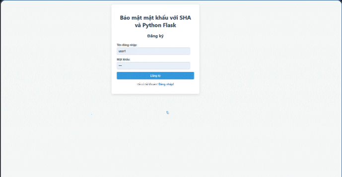
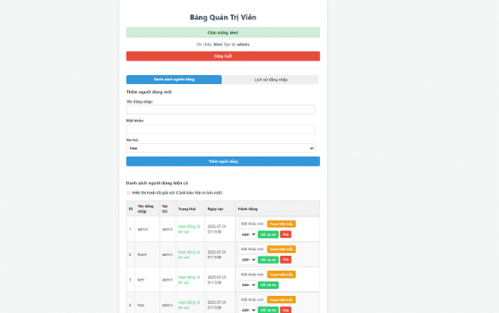
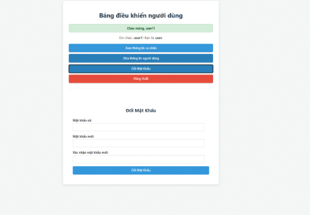
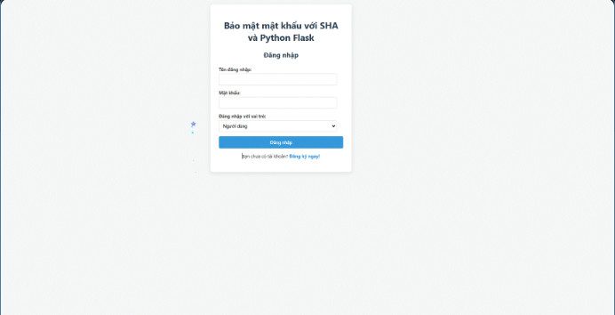

BTL-ATBMTT-nhóm 8
# Ứng dụng Xác thực người dùng an toàn với SHA-256 và Triple DES

## Giới thiệu

Đây là một ứng dụng web đơn giản được xây dựng bằng Flask (Python) nhằm minh họa và triển khai một hệ thống xác thực người dùng an toàn. Dự án tập trung vào việc bảo vệ mật khẩu người dùng trong cơ sở dữ liệu bằng cách sử dụng kết hợp các thuật toán mật mã tiên tiến như **SHA-256** và **Triple DES (3DES)**, cùng với kỹ thuật **Salting** và quy trình băm mật khẩu phức tạp.

Hệ thống cung cấp các chức năng cơ bản cho người dùng như đăng ký, đăng nhập, đổi mật khẩu và quản lý thông tin cá nhân. Đồng thời, nó cũng bao gồm một giao diện quản trị viên mạnh mẽ để quản lý tài khoản người dùng và theo dõi lịch sử hoạt động.

## Tính năng

### Chức năng người dùng

* **Đăng ký tài khoản:** Cho phép người dùng mới tạo tài khoản với tên đăng nhập và mật khẩu duy nhất.

* **Đăng nhập tài khoản:** Xác thực người dùng với khả năng chọn vai trò (`Người dùng` hoặc `Quản trị viên`).

* **Đổi mật khẩu:** Cho phép người dùng đã đăng nhập thay đổi mật khẩu của họ sau khi xác minh mật khẩu cũ.

* **Quản lý thông tin cá nhân:** Cho phép người dùng cập nhật các thông tin như Họ và tên, Ngày sinh, Địa chỉ, Số điện thoại.

* **Xem thông tin cá nhân:** Hiển thị chi tiết thông tin cá nhân của người dùng trên bảng điều khiển.

* **Cảnh báo đăng nhập sai:** Thông báo số lần thử còn lại trước khi tài khoản bị khóa.

* **Tự động khóa tài khoản:** Tự động khóa tài khoản sau 5 lần đăng nhập sai liên tiếp để chống lại các cuộc tấn công vét cạn.

### Chức năng quản trị viên

* **Giao diện quản trị riêng:** Truy cập tại `/admin` sau khi đăng nhập với vai trò `Quản trị viên`.

* **Xem danh sách người dùng:** Hiển thị tất cả tài khoản người dùng với thông tin chi tiết (ID, tên đăng nhập, vai trò, trạng thái khóa, ngày tạo).

* **Hiển thị Hash đã giải mã:** Tùy chọn bật/tắt hiển thị giá trị băm SHA-256 cuối cùng (sau khi giải mã 3DES) cho mục đích kiểm tra (kèm cảnh báo bảo mật).

* **Thêm người dùng mới:** Quản trị viên có thể thêm tài khoản người dùng mới và chỉ định vai trò.

* **Xóa tài khoản:** Xóa tài khoản người dùng và tất cả lịch sử đăng nhập liên quan (không thể tự xóa tài khoản của chính mình).

* **Mở khóa tài khoản:** Mở khóa tài khoản đã bị khóa và đặt lại số lần đăng nhập sai.

* **Đặt lại mật khẩu:** Đặt lại mật khẩu cho bất kỳ người dùng nào, đồng thời mở khóa tài khoản.

* **Thay đổi vai trò:** Thay đổi vai trò của người dùng (từ `user` sang `admin` hoặc ngược lại).

* **Xem lịch sử đăng nhập (Log):** Hiển thị nhật ký chi tiết của tất cả các lần đăng nhập (thành công/thất bại) với thời gian và địa chỉ IP.

### Tính năng bảo mật cốt lõi

Hệ thống triển khai một quy trình xử lý mật khẩu nhiều lớp để tăng cường bảo mật:

1. **Salt ngẫu nhiên cho mỗi người dùng:** Mỗi mật khẩu được kết hợp với một chuỗi ngẫu nhiên (salt) duy nhất trước khi băm. Salt được lưu trữ cùng với mật khẩu đã mã hóa.

2. **Băm mật khẩu bằng SHA-256:** Mật khẩu được băm bằng SHA-256 sau khi được "salting".

3. **Băm tên người dùng bằng SHA-256:** Tên đăng nhập cũng được băm riêng bằng SHA-256.

4. **Kết hợp và băm kép:** Hai giá trị băm từ bước 2 và 3 được nối lại với nhau và sau đó được băm lại một lần nữa bằng SHA-256. Điều này tạo ra một giá trị băm cuối cùng phụ thuộc vào cả mật khẩu và tên đăng nhập, tăng tính duy nhất và độ phức tạp.

5. **Mã hóa kết quả cuối bằng Triple DES (3DES):** Giá trị băm cuối cùng (sau bước băm kép) được mã hóa bằng thuật toán Triple DES trước khi được lưu trữ trong cơ sở dữ liệu. Điều này thêm một lớp bảo vệ nữa, đảm bảo rằng ngay cả khi cơ sở dữ liệu bị truy cập trái phép, các giá trị băm cũng không thể đọc được trực tiếp mà không có khóa 3DES.

## Công nghệ sử dụng

* **Backend:**

  * [Python 3.x](https://www.python.org/)

  * [Flask](https://flask.palletsprojects.com/) (Web Framework)

  * [PyCryptodome](https://pycryptodome.readthedocs.io/en/latest/) (Thư viện mật mã cho SHA-256, Triple DES, Salt, Padding)

  * [SQLite](https://www.sqlite.org/index.html) (Cơ sở dữ liệu file-based)

* **Frontend:**

  * HTML5

  * CSS3

  * JavaScript
## Giao diện người dùng
## Ảnh chụp màn hình

